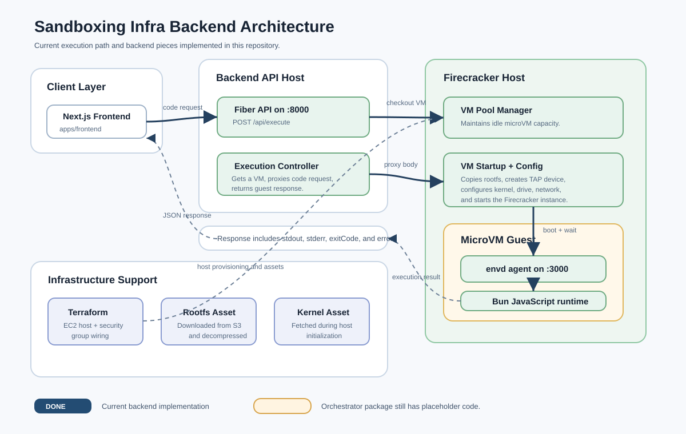

# Sandboxing Infra

Sandboxing Infra is an experimental infrastructure project for running isolated workloads with Firecracker microVMs. The repository currently combines Go packages for interacting with Firecracker and Terraform configuration for provisioning an AWS EC2 host with nested virtualization enabled.

> This project is still in development. APIs, package layout, infrastructure settings, and setup steps are expected to change.

## Architecture



The current backend path accepts a code execution request, checks out a warm Firecracker microVM, forwards the request into the guest agent, executes JavaScript with Bun inside the guest, and returns stdout, stderr, exit code, and error data to the caller.

## Project Goals

- Provision Linux hosts suitable for Firecracker-based sandboxing.
- Start and configure Firecracker microVMs from Go.
- Manage VM networking with TAP devices, IP forwarding, and NAT.
- Build toward orchestration components for sandbox lifecycle management.

## Repository Layout

```text
.
├── main.go                         # Root Go entry point placeholder
├── go.work                         # Go workspace
├── demon/                          # Daemon placeholder package
├── packages/
│   ├── vm/                         # Firecracker client and VM startup code
│   │   ├── client/                 # HTTP client for Firecracker Unix socket API
│   │   └── start/                  # VM startup and network setup helpers
│   ├── envd/                       # Guest execution daemon for JavaScript requests
│   └── orchestator/                # Orchestrator placeholder
└── infra/
    ├── main.tf                     # Terraform AWS provider and EC2 module wiring
    └── modules/ec2/                # EC2 host, security group, and bootstrap scripts
```

## Current Components

### Firecracker VM package

The `packages/vm` module contains early Go code for:

- Creating an HTTP client that talks to the Firecracker API over a Unix socket.
- Sending Firecracker API requests.
- Starting the `firecracker` process with a per-VM API socket.
- Copying the base root filesystem into a per-VM writable rootfs.
- Setting up TAP networking for guest connectivity.
- Configuring machine resources, boot source, root drive, network interface, and instance start actions.
- Maintaining an idle VM pool and routing `POST /api/execute` requests into an available guest.
- Cleaning up Firecracker processes, sockets, TAP devices, and rootfs copies after execution.

### Guest execution daemon

The `packages/envd` module is the in-guest backend agent. It exposes a Fiber API on port `3000`:

- `POST /api/execute/js` accepts a JSON body with a `code` field.
- The submitted code is written to `code.js`.
- The daemon runs the file with `bun run`.
- The response includes `stdout`, `stderr`, `exitCode`, and `error` fields.

### Backend entrypoint

The `packages/vm` server listens on port `8000` with CORS enabled. On startup it prepares `/home/ubuntu/firecracker-lab`, downloads the rootfs from S3 when missing, downloads the Firecracker quickstart kernel when missing, and starts a pool manager targeting eight idle microVMs.

### Infrastructure

The Terraform configuration under `infra/` provisions an AWS EC2 instance using an Ubuntu 22.04 AMI. The EC2 module enables nested virtualization, opens SSH access, and uses `init.sh` to install Firecracker and `jailer`.

The `setup.sh` script includes quickstart-style commands for downloading a kernel and root filesystem, creating a TAP device, and running a Firecracker microVM.

## Prerequisites

- Go, matching the versions declared in the modules and workspace.
- Terraform.
- AWS credentials configured for Terraform.
- An AWS key pair named `ec2aws`, or Terraform changes to use a different key pair.
- A Linux host with KVM support for running Firecracker.
- `firecracker` and `jailer` installed on the target host.

## Development Notes

The project is currently a work in progress. Several packages are placeholders, and some names and configuration values still need cleanup before production use. Treat the current code as an early prototype for Firecracker sandbox infrastructure rather than a complete sandbox platform.

## Useful Commands

Run the VM package:

```sh
go run ./packages/vm
```

Initialize and review Terraform infrastructure:

```sh
cd infra
terraform init
terraform plan -var="AWS_REGION=us-east-1"
```

Apply Terraform only after reviewing the generated plan and confirming the AWS cost and security implications.
